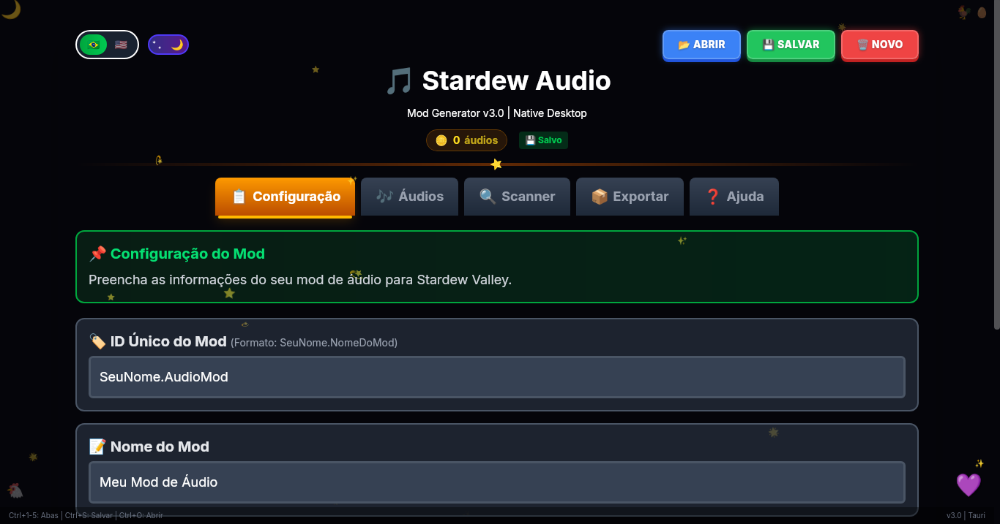
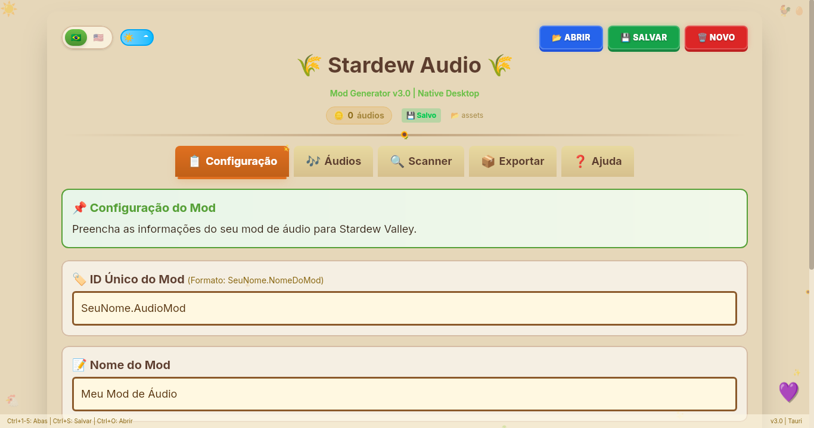
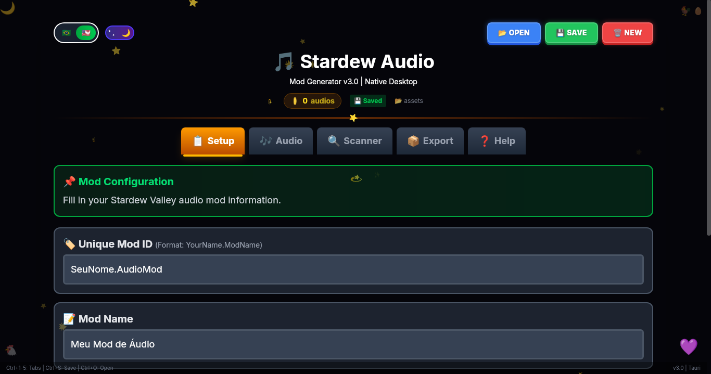
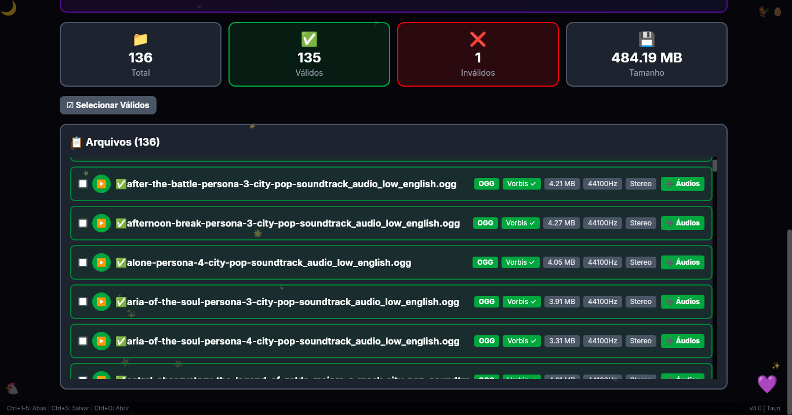
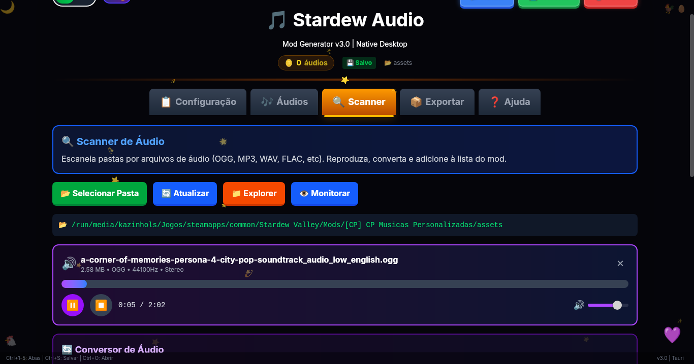
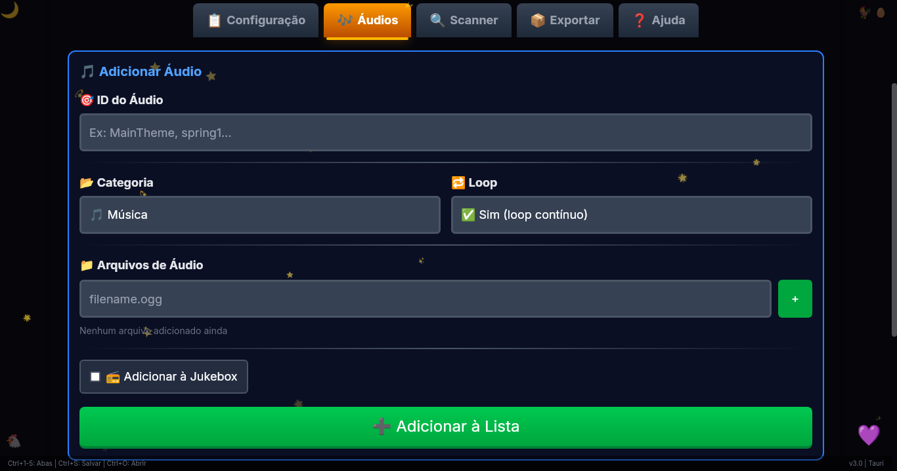
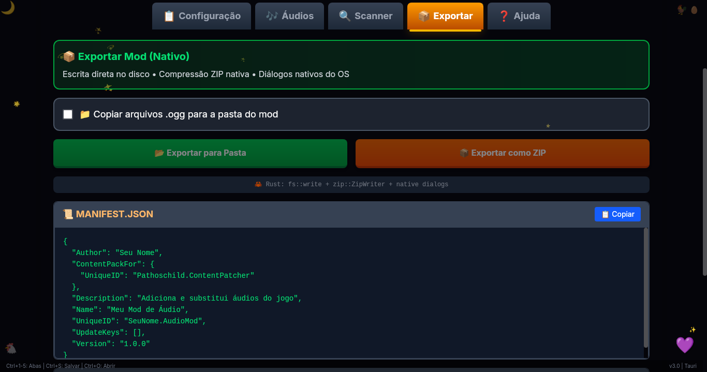
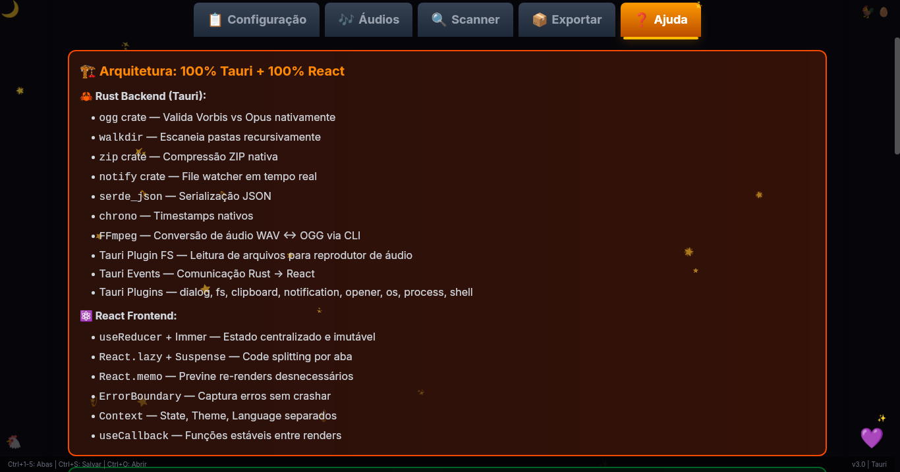

<div align="center">

# 🎵 Stardew Audio Mod Generator v3.0

**Gerador visual de mods de áudio para Stardew Valley 1.6+ com Content Patcher.**

Crie, valide e exporte — tudo em uma interface moderna e intuitiva.

[](https://github.com/Kazinhols/stardew-audio-mod-generator/releases)
[](https://www.stardewvalley.net/)
[](LICENSE)
[](https://tauri.app/)
[](https://react.dev/)
[](https://www.rust-lang.org/)

<br />

[🌐 **Usar Online**](http://stardewaudiohq.qzz.io/) · [📥 **Download Desktop**](https://github.com/Kazinhols/stardew-audio-mod-generator/releases/latest) · [🐛 **Reportar Bug**](https://github.com/Kazinhols/stardew-audio-mod-generator/issues) · [💡 **Sugerir Feature**](https://github.com/Kazinhols/stardew-audio-mod-generator/issues)

</div>

---

## 📋 Sumário

- [🌐 Acesso Rápido](#-acesso-rápido)
- [✨ Funcionalidades](#-funcionalidades)
- [📸 Screenshots](#-screenshots)
- [💾 Instalação](#-instalação)
- [🛠️ Desenvolvimento](#️-desenvolvimento)
- [🏗️ Arquitetura](#️-arquitetura)

---

## 🌐 Acesso Rápido

| Plataforma | Link | Descrição |
|:---:|:---|:---|
| 🌐 **Web** | [**stardewaudiohq.qzz.io**](http://stardewaudiohq.qzz.io/) | Use no navegador, sem instalação |
| 🪟 **Windows** | [**Baixar .exe**](https://github.com/Kazinhols/stardew-audio-mod-generator/releases/latest) | Instalador para Windows 10/11 |
| 🐧 **Linux** | [**Baixar .deb / .AppImage**](https://github.com/Kazinhols/stardew-audio-mod-generator/releases/latest) | Ubuntu/Debian (.deb) ou Portátil (.AppImage) |

> 💡 **Dica:** A versão Desktop oferece funcionalidades exclusivas como scanner nativo de áudios, exportação direta para pasta e compressão ZIP via Rust.

---

## ✨ Funcionalidades

| Feature | Descrição | Disponível em |
|:---|:---|:---:|
| 🎨 **Interface Visual** | Crie mods complexos sem tocar em arquivos JSON | Web + Desktop |
| 🧩 **Editor de Áudios** | Adicione, remova e categorize `AudioCues` | Web + Desktop |
| 🔍 **Scanner de Áudio** | Scanner nativo em Rust para validação técnica (Vorbis/Opus, Sample Rate) | 🖥️ Desktop |
| 🎧 **Reprodutor & Conversor** | Player integrado + conversão OGG ↔ WAV via FFmpeg | 🖥️ Desktop |
| 📂 **Exportação Direta** | Salva toda a estrutura do mod direto na pasta de destino | 🖥️ Desktop |
| 📦 **ZIP Nativo** | Gera o arquivo compactado pronto para distribuição | 🖥️ Desktop |
| 🌐 **Geração de JSON** | Download dos arquivos manifest e content via navegador | 🌐 Web |
| 🔁 **Cross-save** | Compatibilidade total de projetos entre Web e Desktop | Web + Desktop |
| 🌙 **Tema Claro/Escuro** | UI temática inspirada na estética de Stardew Valley | Web + Desktop |
| 🌎 **Idiomas** | Suporte completo a PT-BR e EN-US | Web + Desktop |

---

## 📸 Screenshots

### 🎨 Temas e Idiomas
<div align="center">
  
  
</div>

<br />

<div align="center">
  
</div>

---

### 🔍 Scanner e Editor de Áudio

| 🗂️ Listagem de Arquivos | ⚙️ Scanner Detalhado |
|:---:|:---:|
|  |  |

<br />

<div align="center">
  
</div>

---

### 🎵 Configuração do FFmpeg

Para utilizar as funcionalidades de reprodutor de áudio e conversor automático (WAV ↔ OGG) na versão Desktop, é necessário ter o FFmpeg instalado e acessível no sistema.

## 🪟 Windows
```bash
winget install "FFmpeg (Essentials)"
``` 

## 🐧 Linux
Instale via terminal usando o gerenciador de pacotes da sua distribuição:

Ubuntu / Debian / Mint:
```bash
sudo apt update && sudo apt install ffmpeg
```

Fedora:
```bash
sudo dnf install ffmpeg
```
Arch Linux / Manjaro:
```bash
sudo pacman -S ffmpeg
``` 

## 🍎 macOS
```bash
brew install ffmpeg
``` 

---
### 📦 Exportação e Ajuda

| 🚀 Interface de Exportação | ❓ Central de Ajuda |
|:---:|:---:|
|  |  |

---

## 💾 Instalação

Escolha a versão compatível com o seu sistema operacional na [página de Releases](https://github.com/Kazinhols/stardew-audio-mod-generator/releases/latest).

### 🪟 Windows
1. Baixe o instalador `.exe` (ex: `StardewAudio-v3.0.0-setup.exe`).
2. Execute o arquivo.
3. O aplicativo será instalado e abrirá automaticamente.
> ⚠️ **Nota:** Se o Windows exibir a mensagem "Protegeu o seu PC" (SmartScreen), clique em **Mais informações** e depois em **Executar assim mesmo**. Isso acontece porque o aplicativo ainda não possui uma assinatura digital da Microsoft.

### 🐧 Linux
Oferecemos dois formatos para distribuições Linux:

**Opção A: .deb (Ubuntu/Debian/Mint)**
1. Baixe o arquivo `.deb`.
2. Instale com dois cliques ou via terminal:
   ```bash
   sudo dpkg -i stardew-audio_3.0.0_amd64.deb
**Opção B: .AppImage (Universal/Portátil)**
1. Baixe o arquivo `.AppImage`.
2. Dê permissão de execução e rode:
   ```bash
   chmod +x StardewAudio-3.0.0.AppImage
   ./StardewAudio-3.0.0.AppImage
### 🍎 macOS
1. Baixe a imagem de disco `.dmg`.
2. Arraste o ícone do **Stardew Audio** para a pasta **Applications**.
> ⚠️ **Nota:** Na primeira execução, se aparecer um aviso de "Desenvolvedor não identificado":
> 1. Vá em **Preferências do Sistema** > **Segurança e Privacidade**.
> 2. Clique em **Abrir Mesmo Assim** (Open Anyway).   


---

## 🛠️ Desenvolvimento

Se você deseja contribuir com o código ou compilar por conta própria:

### Pré-requisitos
- [Node.js](https://nodejs.org/) (v18+)
- [Rust](https://www.rust-lang.org/) (Cargo)

### Rodando localmente

1. Clone o repositório:
 ```bash
   git clone https://github.com/Kazinhols/stardew-audio-mod-generator.git
   cd stardew-audio-mod-generator
``` 
2. Instale as dependências:
  ```bash
  npm install
# ou
yarn install   
```

3. Inicie o modo de desenvolvimento:
```bash
npm run tauri dev
# ou
cargo tauri dev
``` 
---
### 🏗️ Arquitetura

O projeto utiliza uma arquitetura híbrida com **React** no frontend e **Rust** no backend, comunicando-se via IPC do Tauri.

```text
┌───────────────────────────────────────┐    IPC     ┌───────────────────────────────────────┐
│         Frontend (React 19)           │◄──────────►│          Backend (Tauri + Rust)       │
├───────────────────────────────────────┤            ├───────────────────────────────────────┤
│ • Context API (estado global)         │ invoca     │ • ogg crate (validação Vorbis/Opus)   │
│ • Immer (mutações imutáveis)          │  comandos  │ • walkdir (scanner recursivo)         │
│ • TailwindCSS + tema Stardew          │            │ • zip crate (compressão ZIP)          │
│ • i18n (PT-BR / EN-US)                │   dados    │ • notify (file watcher)               │
│ • React.lazy + Suspense (tabs)        │  de volta  │ • FFmpeg (conversão OGG ↔ WAV)        │
└───────────────────────────────────────┘            └───────────────────────────────────────┘  

---

## 📝 Licença

Distribuído sob a licença **MIT**. Veja o arquivo [LICENSE](LICENSE) para mais detalhes.

Copyright © 2026 Kazinhols.